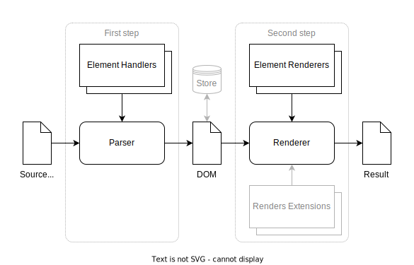

# [EN] [Markdown parser & HTML render](https://etcdema.github.io/DmMD/ "View example")

1. **Modular** *all elements - modules*
1. **Extensible** *easy create new elements, may use only needed, builtin elements may use extensions*
1. **Fast** *just compare with the one you are using, maybe there is something faster with similar features*
1. And **compact** *minified version about 10Kb, dev version ~ 30Kb*.

## Why this implementation was made.

In the projects where I took part, there was a need to generate HTML based on markdown, but different system modules required a different set of elements: for publishing articles, a full set and add-ons for inserting widgets, for chats, a minimum set of text formatting.

In each case, the most suitable markdown translator was selected, which led to the complexity of system development and support.

This implementation allows you to use exactly the set of elements that are needed in a particular case and unify work with markdown.

Additionally, the implementation allows you to immediately build a DOM based on data, for example from a database, and then generate HTML with the same structure as based on markdown text.

## How it works



In the first stage, the parser extracts block type elements, then extracts inline type elements in those elements where it is needed.

The second step is rendering the DOM into HTML.

Between the first and second step you can transform the DOM or save/restore if necessary.

## How to use

1. Include the script `https://etcdema.github.io/DmMD/dist/dm.md@1.min.js` in html in one of the following ways:
     * Using the `<script>` tag - creates a global `DmMD` object
     * With AMD bootloader
     * As a module
1. Create parser with necessary elements handlers:
   ```js
   const parse = new DmMD.parser(DmMD.elements.$ALL);
   ``````
   `DmMD.elements.$ALL` contains base elements from `DmMD.elements` read only collection, you can create own array, contains what you needed from `DmMD.elements` and/or add custom handlers.
1. Build DOM:
    ```js
    const doc = parse(markdownText);
    ``````
    The function `parse` can be executed as many times as required, repeated creation is required only when the collection of necessary elements changes.
1. Render to HTML:
    ```js
    const html = DmMD.HTML.render(doc);
    ``````
    If you need use extensions for base or custom elements renders just create collection and pass it into the render function:
    ```js
    const html = DmMD.HTML.render(doc, { 
        // Local links will open in this tab
        linkTarget: (url) => (url.url[0]!=='/' && '_blank')
    });
    ``````
* * *
# [RU] [Парсер Markdown разметки и генератор HTML](https://etcdema.github.io/DmMD/ "Посмотреть пример")

1. **Модульный** *все элементы - модули*
1. **Расширяемый** *легко создавать новые элементы, можно использовать только необходимые, встроенные элементы могут использовать расширения*
1. **Быстрый** *просто сравните с тем, которым пользуетесь, может есть что-то быстрее с похожими возможностями*
1. И **компактный** *минифицированная версия около 10Кб, версия для разработчиков ~ 30Кб*.

## Зачем сделана эта реализация.

В проектах, где я принимал участие, была необходимость генерации HTML на основе markdown но в разных модулях систем требовался разный набор элементов: для публикации статей полный набор и дополнения для вставки виджетов, для чатов минимальный набор форматирования текста.

В каждом случае выбирался наиболее подходящий markdown транслятор, что приводило к усложению разработки и поддержки систем.

Эта реализация позволяет использовать ровно тот набор элементов, который необходим в конкретном случае и унифицировать работу с markdown.

Дополнительно реализация позволяет сразу строить DOM по данным, например из базы, и потом генерить HTML тое же структуры, что и на основе markdown текста.

## Как это работает


На первом этапе парсер извлекает элементы блочного типа, затем извлекает элементы строчного типа в тех элементах, где это необходимо.

Второй шаг — рендеринг DOM в HTML.

Между первым и вторым шагом вы можете преобразовать DOM или сохранить/восстановить, если это необходимо.

## Как использовать

1. Включите скрипт `https://etcdema.github.io/DmMD/dist/dm.md@1.min.js` в html одним из следующих способов:
   * Использование тега `<script>` — создает глобальный объект `DmMD`
   * В качестве модуля
   * Используя AMD загрузчик
1. Создать парсер с необходимыми обработчиками элементов:
    ```js
    const parse = new DmMD.parser(DmMD.elements.$ALL);
    ``````
    `DmMD.elements.$ALL` содержит базовые элементы из коллекции `DmMD.elements`, доступной только для чтения. Вы можете создать собственный массив, содержать все необходимое из `DmMD.elements` и/или добавить собственные обработчики.
1. Построить DOM:
    ```js
    const doc = parse(markdownText);
    ``````
    Функцию `parse` можно выполнять сколько угодно раз, повторное создание требуется только при изменении коллекции необходимых элементов.
1. Генерация HTML:
    ```js
    const html = DmMD.HTML.render(doc);
    ``````
    Если вам нужно использовать расширения для рендеринга базовых или пользовательских элементов, просто создайте коллекцию и передайте ее в функцию рендеринга:
    ```js
    const html = DmMD.HTML.render(doc, { 
        // Local links will open in this tab
        linkTarget: (url) => (url.url[0]!=='/' && '_blank')
    });
    ``````
